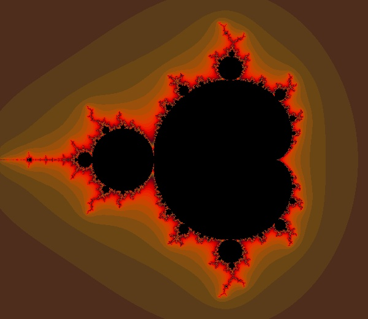
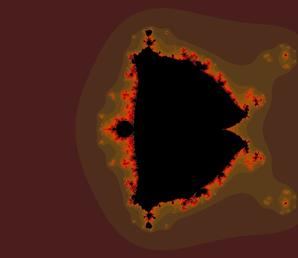
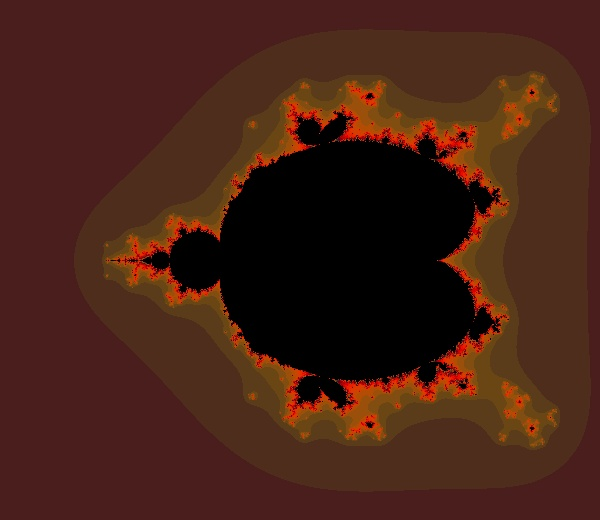

# mandelbrot

draw mandelbrot like images, refer to [Mandelbrot 集合，将 TensorFlow 应用于普通数学](http://t.cn/EUtXxaU)

## Install

- python 3
- tensorflow
- numpy
- opencv

## Run

```
python3 mandelbrot.py
```

## Example Result

- Standard mandelbrot image



- Flying squirrel



- Swimming Turtle

